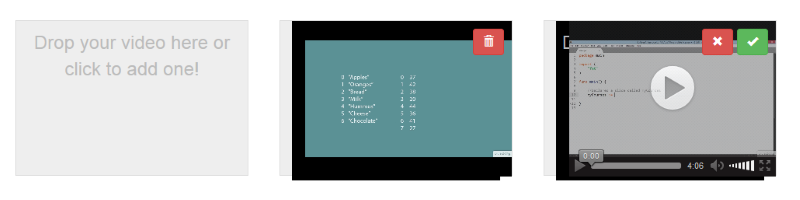

# ajax-video-uploader
HTML5 ajax video uploader 



### Dependancies 
- jQuery
- Bootstrap 3

### Usage
```html
  <div class="videozone col-md-3"
       data-url="/Home/Upload"
       style="width: 300px; height: 200px">
      <input type="file" name="video" />
  </div>
```

```javascript
  <script type="text/javascript">
      $('.videozone').html5videoupload();
  </script>
```


